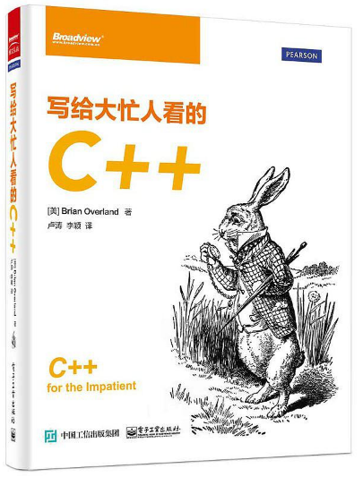
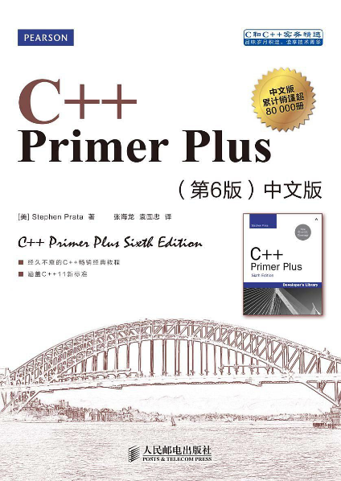
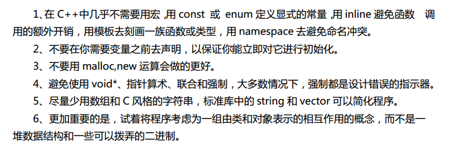

# CPP学习笔记

      Please watch or star this repo, I'll be more happy if you follow me~

## 仓库目录

* [**Cpp-Primer-Plus-Answer**](Cpp-Primer-Plus-Answer/) Cpp Primer Plus 参考答案
* [**C-plus-plus-For-the-Impatient**](C-plus-plus-For-the-Impatient/) 写给大忙人看的C++
* [**学习笔记**](docs/) 学习笔记

__建议Watch本repo, 可以收到更新的邮件推送(点右上角的Watch)__

## 参考书目

* C-plus-plus-For-the-Impatient
* C++ Primer Plus (第6版) 中文版

## 为什么建这个项目

为了学习，为了找工作

## C++之父给 C 程序员的建议

## 如何分享自己的东西

你可以直接把想添加的内容发在 issues 里(想象成论坛的帖子), 我会添加进去
或者Fork这个项目, 修改后再发起Pull Request来合并修改。
