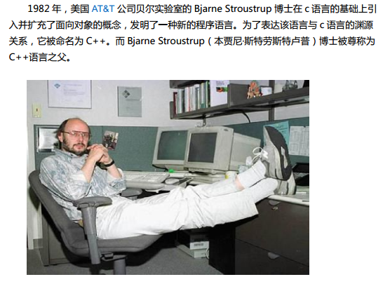

<!-- TOC depthFrom:1 depthTo:6 withLinks:1 updateOnSave:1 orderedList:0 -->

- [CPP简介](#cpp简介)
	- [作者](#作者)
	- [历史背景](#历史背景)
	- [C++标准](#c标准)
	- [C++ 的本质](#c-的本质)
	- [总结](#总结)

<!-- /TOC -->
# CPP简介

## 作者

## 历史背景

C 语言作为结构化和模块化的语言，在处理较小规模的程序时，比较得心应手。但是当问题比较复杂，程序的规模较大的时，需要高度的抽象和建模时，c 语言显得力不从心。

为了解决软件危机，20 世纪 80 年代，计算机界提出了 OOP(object oriented programming)思想，这需要设计出支持面向对象的程序设计语言。Smalltalk 就是当时问世的一种面向对象的语言。而在实践中，**人们发现 c 是如此深入人心，使用如此之广泛，以至于最好的办法，不是发明一种新的语言去取代它，而是在原有的基础上发展它**。在这种情况下 c++应运而生，最初这门语言并不叫 c++而是 c with class (带类的 c)。

这里体现了兼容的思想。

## C++标准

* C++ 98 标准

C++标准第一版，1998年发布。正式名称为ISO/IEC 14882:1998

* C++ 03 标准

C++标准第二版，2003年发布。正式名称为ISO/IEC 14882:2003

* C++ 11 标准

C++标准第三版，2011年8月12日发布。正式名称为ISO/IEC 14882:2011。

C++11对容器类的方法做了三项主要修改。首先，新增的右值引用使得能够给容器提供移动语义。其次，由于新增了模板类initilizer_list，因此新增了将initilizer_list作为参数的构造函数和赋值运算符。第三，新增的可变参数模板（variadic template）和函数参数包（parameter pack）使得可以提供就地创建（emplacement）方法。

* C++ 14 标准

C++标准第四版，2014年8月18日发布。正式名称为ISO/IEC 14882:2014。

C++14是C++11的增量更新，主要是支持普通函数的返回类型推演，泛型 lambda，扩展的 lambda 捕获，对 constexpr 函数限制的修订，constexpr变量模板化等

## C++ 的本质

C++语言的名字，如果看作 c 的基本语法，是由操作数 c 和运算符后++构成。C++是本身这门语言先是 c,是完全兼容 c.然后在此基础上++。这个++包含三大部分，c++对 c的基础语法的扩展，面向对像(继承，封装，多态)，STL 等。

## 总结
