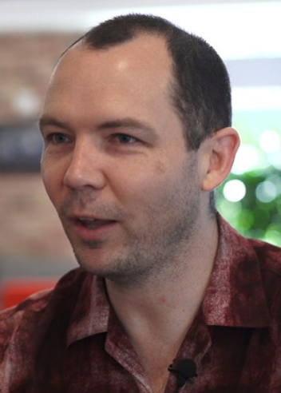

# 杂谈-独立开发者Jonathan_Blow再次炮轰C++




```
Jonathan Blow 是著名独立解密游戏《Braid》和《The Witness》的作者，近日，他表示 C++ 真的是一种可怕的语言，可怕到他要停下手中的工作发明一种新语言来改善程序员们的生活质量。对于 C++，他认为在游戏开发过程中，过于复杂的层状生态系统增加了解决不同问题的复杂度。由此，他开发了一种名为 Jai 的语言来解决此问题，目前 Jai 还在开发之中，尚未公开。
```

在 2014 年的某个时刻，Jonathan Blow 正在开发《The Witness》游戏，彼时他突然感觉敲代码可能是一种悲惨的经历。

那是为什么呢？套用 Blow 的话来说，“这是因为 C ++ 是一种「非常糟糕且可怕的语言」。”

他在 Gamelab Barcelona 演讲时阐述了他认为常用编程语言的问题，以及他希望通过自及研发的替代品——Jai，来实现预期的开发目标。

Blow 认为，C ++ 的主要缺陷在于它是一个非常复杂和分层的生态系统，在解决不同问题的过程中变得越来越复杂；层数越多，堆叠越高，那么也就变得越不稳定，理解起来就越难。

“人们认为编程语言应该是一个复杂的生态系统，”Blow 如是说。 “我不想学习一年的生态系统之后，只在那里放置个 3D 图形。”

之所以开发 Jai，Blow 是希望以此实现三件事：

提高程序员的生活质量，因为“我们不应该像我们中的许多人那样悲惨”；

简化系统；

通过允许程序员使用少量代码构建大量功能来增强表达能力。

目前，Jai 的生产率提高了约 15％，但 Blow 认为，随着时间的推移，它可能会提高到 50％ - 80％。

倘若他对该语言的预测准确，那么重塑独立和 3A 级的游戏开发也就指日可待了。

---

## C++ 的混乱


C++ 诞生于 20 世纪 70 年代，是以 C 语言为原型。经过了数十年的发展，C++ 发生了巨大的变化，层层叠叠的“历史残余和古怪”的定义阻碍了其发展，C++ 变得越来越混乱。

Blow 表示，“如果你已刚入手去学习 C++，或许你正在学习的很多东西比较碎片化。C ++ 在某种程度上是一种强大的语言，因为它是我们制作游戏的关键性语言。但是如今的它正在使我们的过程更加艰难。”

随着项目变得越来越大，修复更改所需的时间越来越长，由此编程的本质意味着大量的时间专注于“繁琐的工作”。

于是，Blow 开始思考，是否会有人对此做一些改变。但不久之后，他便否决了这一荒谬的想法，毕竟每个人都有很多不同的选择。作为游戏开发者，Blow 仅使用了 C++ 这一语言开发游戏，而其他的开发者可以选择其他的编程语言。

很多人或许会说，也可以更换语言开发。但是现实是，公司拥有非常庞大的游戏引擎，替换成本非常高。几年前，像《刺客信条》这番的游戏就有一千万行源代码，它现在或许更大了。

而就是以上这种“现状偏见”在行业内产生了惰性，开发者不会在他们已经拥有一套完整任务的系统后重写所有系统，无论这个过程多么繁琐。现在很多人都会有一种失败主义的态度。“我实际上也有，那个小小的现实主义声音在我耳边告诉我，我无法改变这一点。”Blow 表示。但由于某种原因，他决定质疑：真的没法改变了吗？

```
“我越是质疑它，我说的越多'实际上这是多变的。我想我看到了我们在这里做的具体事情'。一旦知道有办法改变它，我突然间对我的日常工作感到非常高兴，因为突然之间有一条出路。“
```

到目前为止，Blow 和他的团队正在深入开发《The Witness》游戏，所以 Jai 仍然是一个辅助项目，还在开发者。然而，未来几年，这是 Blow 和他在 Thekla 公司的团队的主要焦点。目前他有一个未公布的游戏项目，其表示，是使用 Jai 建立的，旨在“测试对现实的想法”。

---

## 网友看法

不止 Jonathan Blow 这样说，早年间，Linux 之父 Linus Torvalds 也曾表明 C++ 是一门很恐怖的语言，而比它更恐怖的是很多不合格的程序员在使用着它。那么倘若撇开企业的项目需求，C++ 本身而言真的是一门“可怕的编程语言”吗？对此，不少网友表示：

* 我已经用了 C ++ 很多年了。我忽略了它很多的特性，因为我不需要使用全部。没有人说你必须使用它的每一点。在工作中，只需知道部分并完整地了解该工具如何才能完成工作，这就很好了。如今诋毁 C ++ 似乎成了一种趋势，但如果你不擅长做某件事，你就会对此表达不好的情绪。基于这一年，每一种编程语言都有优劣，都会被人吐槽。

* 没有“真正可怕的语言”，只是“非常可怕的程序员”。除了 C ++ 之外，还有 PHP、Javascript、APL、Ada 和 BASIC。

* C ++ 从一个非常清晰的语法开始，大大简化了一些重要的编程任务。 随着人们越来越熟悉这种语言，他们发现了新的编程模式，语言无法很好地处理，因此增加了新的语法或功能，导致膨胀。如今 C ++ 已经存在了一段时间，并且已经添加了许多新东西，它已成为一种成熟的语言。 在某些时候，总是有人会提出一种新的通用语言，它以一致的语法结合了 C ++ 的许多优点，对许多人来说很有用，而不仅仅是为了开发游戏或者 Web。但是为解决一些特定的功能，然后循环重复开发新的语言，那生态也会乱。

* C ++ 很好，只要你在 C ++ 11 之前保持功能级别并且不使用 STL。

* C ++ 太可怕了。我讨厌它的多态性。更糟糕的是，很多人认为多态性是一种理想的功能，有助于创建清晰、可读的代码。它鼓励创建对类进行操作的函数而不是对通用数据类型。

## 参考链接

<https://www.gamesindustry.biz/articles/2018-07-02-jonathan-blow-c-is-a-weird-mess>
